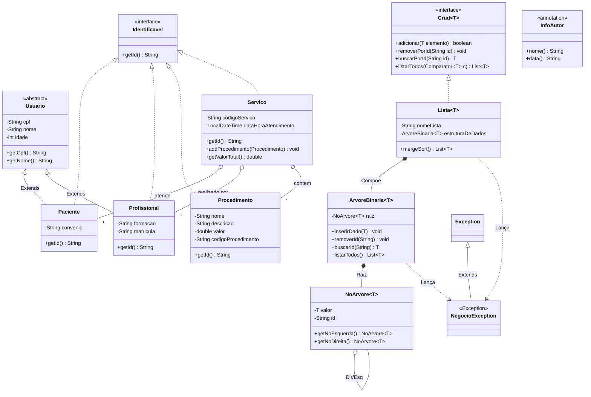

```mermaid
classDiagram
    %% --- Interfaces ---
    class Identificavel {
        <<interface>>
        +getId() String
    }

    class Crud~T~ {
        <<interface>>
        +adicionar(T elemento) boolean
        +removerPorId(String id) void
        +buscarPorId(String id) T
        +listarTodos(Comparator~T~ c) List~T~
    }

    %% --- Classe Abstrata / Base ---
    class Usuario {
        <<abstract>>
        -String cpf
        -String nome
        -int idade
        +getCpf() String
        +getNome() String
    }

    %% --- Models (Entidades) ---
    class Paciente {
        -String convenio
        +getId() String
    }

    class Profissional {
        -String formacao
        -String matricula
        +getId() String
    }

    class Procedimento {
        -String nome
        -String descricao
        -double valor
        -String codigoProcedimento
        +getId() String
    }

    class Servico {
        -String codigoServico
        -LocalDateTime dataHoraAtendimento
        +getId() String
        +addProcedimento(Procedimento) void
        +getValorTotal() double
    }

    %% --- Estrutura de Dados ---
    class NoArvore~T~ {
        -T valor
        -String id
        +getNoEsquerda() NoArvore~T~
        +getNoDireita() NoArvore~T~
    }

    class ArvoreBinaria~T~ {
        -NoArvore~T~ raiz
        +inserirDado(T) void
        +removerId(String) void
        +buscarId(String) T
        +listarTodos() List~T~
    }

    class Lista~T~ {
        -String nomeLista
        -ArvoreBinaria~T~ estruturaDeDados
        +mergeSort() List~T~
    }

    %% --- Exceções e Annotations ---
    class NegocioException {
        <<Exception>>
    }

    class InfoAutor {
        <<annotation>>
        +nome() String
        +data() String
    }

    %% --- Relacionamentos de Herança (Extends) ---
    Usuario <|-- Paciente : Extends
    Usuario <|-- Profissional : Extends
    Exception <|-- NegocioException : Extends

    %% --- Relacionamentos de Implementação (Implements) ---
    Identificavel <|.. Paciente
    Identificavel <|.. Profissional
    Identificavel <|.. Procedimento
    Identificavel <|.. Servico
    Crud <|.. Lista

    %% --- Relacionamentos de Estrutura de Dados (Composição) ---
    Lista *-- ArvoreBinaria : Compoe
    ArvoreBinaria *-- NoArvore : Raiz
    NoArvore o-- NoArvore : Dir/Esq

    %% --- Relacionamentos de Negócio (Agregação) ---
    Servico o-- "1" Paciente : atende
    Servico o-- "1" Profissional : realizado por
    Servico o-- "*" Procedimento : contem
    
    %% --- Dependências Gerais ---
    Lista ..> NegocioException : Lança
    ArvoreBinaria ..> NegocioException : Lança
```